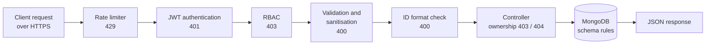
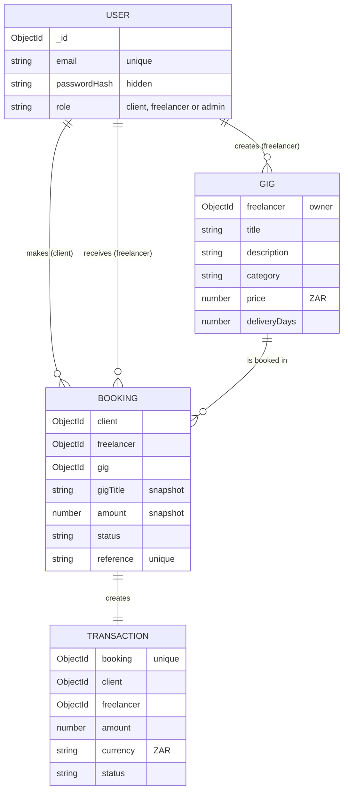

<div align="center">

# 💼 HustleHub+

### A secure freelance marketplace built on the MERN stack

**INSY7314 · Part 2 — Secure Full-Stack Application · Group 7**


</div>

---

HustleHub+ is a secure freelance marketplace platform that allows freelancers to advertise their services and clients to browse and book them. Beyond standard marketplace functionality, the platform records a financial transaction for every booking and provides freelancers with an indication of income earned and estimated tax obligations.

Because the platform processes sensitive information — user credentials, transactional records and income-related data — security has been treated as a primary design concern from the outset rather than added afterward.

| Part | Focus | Status |
|:----:|-------|:------:|
| **1** | Secure backend foundations | ✅ Complete |
| **2** | Full-stack application development | ✅ **This submission** |
| **3** | DevSecOps, monitoring and finalisation | 🔲 Upcoming |

## 📑 Table of contents

- [What changed since Part 1](#what-changed)
- [Features](#features)
- [System overview](#system-overview)
- [Intended users](#intended-users)
- [Architecture](#architecture)
- [Security features overview](#security-features-overview)
- [Backend structure](#backend-structure)
- [Request flow](#request-flow)
- [Database and data models](#database-and-data-models)
- [Security implementation](#security-implementation)
- [API endpoint reference](#api-endpoint-reference)
- [Setup](#setup)
- [Testing](#testing)
- [Screenshots](#screenshots)
- [Demonstration video](#demonstration-video)
- [Team and contributions](#team-and-contributions)
- [References](#references)

<a id="what-changed"></a>
## 🆕 What changed since Part 1

| Area | Part 1 | Part 2 |
|------|--------|--------|
| **Data storage** | Temporary in-memory array | MongoDB Atlas via Mongoose |
| **Features** | Registration and login only | Gigs, bookings, transactions and income tracking |
| **Frontend** | None | React application |
| **Access control** | Authentication only | Role-based access control and resource ownership checks |
| **Rate limiting** | None | Login, registration and booking endpoints |
| **Security headers** | None | Helmet with a Content Security Policy |
| **Demo data** | Manual registration | `npm run seed` creates demo users, gigs, bookings and transactions |

> [!NOTE]
> **Part 1 feedback addressed**
> - **README accuracy:** the [Security features overview](#security-features-overview) lists only features that are implemented in the code, and shows which part each one was introduced in.
> - **JWT hardening:** tokens are signed and verified with an explicit algorithm, issuer and audience (see [Authentication](#authentication)).
> - **Unexpected fields:** requests containing fields that are not on an endpoint's allowlist are rejected (see [Input validation and sanitisation](#input-validation-and-sanitisation)).

---

<a id="features"></a>
## ✨ Features

### Backend

- User registration and login backed by MongoDB, with hashed passwords and JWT authentication
- Gig management — freelancers can create, view, update and delete their own gigs
- Gig browsing with an optional category filter, and a single-gig view
- Booking a gig with a simulated confirmation reference (no real payment is processed)
- Automatic transaction record for every booking, linked to both the client and the freelancer
- Booking history for clients (bookings made) and freelancers (bookings received)
- Income summary for freelancers, including an estimated tax figure
- Rate limiting on authentication and booking endpoints
- Seed script that creates demo accounts, gigs, bookings and transactions

### Frontend

- Registration and login pages, with client-side validation and clear, non-technical error messages
- Protected routes that redirect to login when signed out, and away from pages a user's role cannot access
- Gig browsing with an optional category filter, and a gig detail page
- A one-click booking flow with a simulated confirmation screen showing the booking reference and amount
- A client bookings page showing booking history
- A freelancer dashboard with three tabs: my gigs (create and delete), bookings received, and an income summary with the estimated tax figure
- An admin page with tables for all users, all gigs and all bookings
- Invalid input is caught before a request is sent (e.g. a gig price must be a positive number, a title must be at least 3 characters), and every API error is shown as a plain, user-facing message — raw server errors, stack traces and status codes are never displayed in the UI

---

<a id="system-overview"></a>
## 🧭 System overview

HustleHub+ is built on the MERN stack — MongoDB, Express, React and Node.js. The MERN architecture was selected because it allows the development team to use JavaScript across both the frontend and backend, supporting consistent development conventions and data handling across the application.

In Part 2, the temporary in-memory user store from Part 1 has been replaced with a MongoDB Atlas database accessed through Mongoose (Mongoose, 2025). The system now supports the full marketplace flow: authentication, gig management, bookings, transaction recording and income tracking.

<a id="intended-users"></a>
## 👥 Intended users

| Role | Description | Key capabilities |
|------|-------------|------------------|
| **Client** | A user looking to hire freelance services | Browse gigs, book gigs, view their own booking history |
| **Freelancer** | A user offering services on the platform | Create and manage their own gigs, view bookings received, view income and estimated tax |
| **Admin** | Platform administrator | Oversee platform activity (see [Role-based access control](#role-based-access-control)) |

Public registration only allows the `client` and `freelancer` roles, so an admin account cannot be self-registered. Admin accounts are created only through the seed script.

<a id="architecture"></a>
## 🏗️ Architecture


The React frontend communicates with the Express backend using a REST API with JSON over HTTPS. The backend connects to a MongoDB Atlas database.

All security-relevant logic sits inside the backend's **trust boundary**, before any data reaches the database. A trust boundary marks the point where data crosses from a less trusted context (the client) into a more trusted, controlled one (the server). Anything that arrives from the client — request bodies, URL parameters, query strings and tokens — is treated as untrusted until the backend has verified it.

---

<a id="security-features-overview"></a>
## 🛡️ Security features overview

| Security feature | Introduced in |
|------------------|:-------------:|
| Password hashing with bcrypt | Part 1 |
| JWT authentication on all protected routes | Part 1 |
| HTTPS with a locally trusted certificate | Part 1 |
| Centralised, non-revealing error handling | Part 1 |
| Password hashes excluded from all database queries and API responses | Part 2 |
| Unique email enforced at database level | Part 2 |
| Resource ownership checks (users can only modify their own gigs) | Part 2 |
| Own-data-only endpoints (my gigs, my bookings, bookings received, income) | Part 2 |
| Mass assignment protection (owner and price taken from trusted sources) | Part 2 |
| ID format validation on URL parameters | Part 2 |
| Atomic booking and transaction creation | Part 2 |
| Rate limiting on login, registration and booking | Part 2 |
| JWT algorithm, issuer and audience validation *(Part 1 feedback)* | Part 2 |
| Role-based access control (RBAC) | Part 2 |
| Rejection of unexpected request fields *(Part 1 feedback)* | Part 2 |
| Validation and sanitisation on all endpoints (NoSQL injection and XSS) | Part 2 |
| Security headers with Helmet and Content Security Policy | Part 2 |

---

<a id="backend-structure"></a>
## 📁 Backend structure

| Folder | Responsibility |
|--------|----------------|
| `src/config` | Database connection setup |
| `src/routes` | Defines API endpoints and maps them to controllers and middleware |
| `src/controllers` | Handles request and response logic, including ownership checks |
| `src/models` | Mongoose schemas for users, gigs, bookings and transactions |
| `src/services` | Reusable logic such as password hashing and JWT handling |
| `src/middleware` | Authentication, authorisation, validation, ID format checks, rate limiting and error handling |
| `src/utils` | Shared helpers, including the consistent `{ success, message }` response format |
| `scripts` | Development scripts, including the demo data seed script |

Routes decide *where* a request goes, middleware decides *whether* it may proceed, controllers decide *what* happens to it, and models define and protect the stored data.

<a id="request-flow"></a>
## 🔄 Request flow



1. **Rate limiting** — on sensitive endpoints, requests over the limit are rejected with `429`
2. **Authentication** — the JWT is verified; missing or invalid tokens are rejected with `401`
3. **Authorisation** — the user's role is checked against the route; unauthorised roles are rejected with `403`
4. **Validation and sanitisation** — invalid, unexpected or malicious input is rejected with `400`
5. **ID validation** — on routes with an ID in the URL, malformed IDs are rejected with `400`
6. **Controller** — performs existence and ownership checks (`404` / `403`) and builds the data from trusted sources only
7. **Model** — Mongoose applies schema rules before anything is saved
8. **Response** — a consistent `{ success, message, ... }` JSON response is returned

> [!IMPORTANT]
> **🛠️ P2 / P3 — to be completed**
> Confirm that the diagram and steps above match the order your RBAC (P2) and validation and sanitisation (P3) middleware actually run in, and adjust them if needed.

---

<a id="database-and-data-models"></a>
## 🗄️ Database and data models

HustleHub+ uses **MongoDB Atlas** with four collections, defined as Mongoose schemas in `src/models`.



All models use automatic `createdAt` and `updatedAt` timestamps.

**💡 Design decisions**

- **Ownership is stored on every record.** Gigs store their `freelancer`, and bookings and transactions store both the `client` and the `freelancer`, so every request can be checked against the logged-in user.
- **Bookings store a snapshot of the gig.** The gig title and price are copied into the booking when it is made, so booking and transaction history stays accurate even if the gig is later edited or deleted.
- **One transaction per booking.** A unique index on `Transaction.booking` makes duplicate financial records impossible, so income can never be counted twice.
- **Schema-level limits.** Every field has type, length or range limits (e.g. price between R1 and R1,000,000, and a fixed list of categories), so invalid data is rejected at the database layer as a second line of defence.
- **Indexes on lookup fields.** `freelancer` and `client` fields are indexed to keep "my gigs", booking history and income calculations fast.

---

<a id="security-implementation"></a>
## 🔐 Security implementation

### Password storage

Passwords are hashed with bcrypt (10 salt rounds) before being saved, and plaintext passwords are never stored or logged. The `passwordHash` field is also marked `select: false` in the User model, so MongoDB never returns it unless the code explicitly requests it — which only happens during login, to verify the password. A `toJSON` rule additionally strips it from any user object sent in a response, so password hashes cannot leak through any endpoint, including ones that display user details such as bookings.

### Authentication

On successful login, the backend issues a JWT containing only the user's ID and role, signed with a secret loaded from `.env`. Protected routes verify the token before any other processing, and login returns the same generic message for an unknown email or a wrong password, preventing user enumeration.

Following Part 1 feedback, the token is now signed and verified with three explicit settings rather than relying on defaults:

- **Algorithm (`HS256`)** is pinned on both signing and verification. Without this, a forged token could specify a different or weaker algorithm (including `none`) and potentially bypass signature checking — explicitly pinning and checking the algorithm closes that gap.
- **Issuer (`hustlehub-api`)** identifies this API as the token's source.
- **Audience (`hustlehub-client`)** identifies the HustleHub+ frontend as the token's intended recipient.

`jwt.verify()` is called with all three constraints, so a token that is correctly signed but has the wrong algorithm, issuer or audience is rejected before its payload is ever trusted — not just a malformed or expired token.

### Role-based access control

An `authorize(...allowedRoles)` middleware runs after `authenticate` on every protected route. It reads the role from the verified JWT payload (never from the request body, which the client could tamper with) and rejects the request with `403` if that role is not in the route's allowed list. Because it runs immediately after authentication and before any booking-rate-limiting or controller logic, an unauthorised role is rejected as early as possible in the request lifecycle.

| Endpoint | Client | Freelancer | Admin |
|----------|:------:|:----------:|:-----:|
| `POST /api/gigs` | ❌ | ✅ | ❌ |
| `GET /api/gigs` | ✅ | ✅ | ✅ |
| `GET /api/gigs/mine` | ❌ | ✅ | ❌ |
| `GET /api/gigs/:id` | ✅ | ✅ | ✅ |
| `PATCH /api/gigs/:id` | ❌ | ✅ (own gigs only) | ❌ |
| `DELETE /api/gigs/:id` | ❌ | ✅ (own gigs only) | ❌ |
| `POST /api/bookings` | ✅ | ❌ | ❌ |
| `GET /api/bookings/mine` | ✅ | ❌ | ❌ |
| `GET /api/bookings/received` | ❌ | ✅ | ❌ |
| `GET /api/income/summary` | ❌ | ✅ | ❌ |
| `GET /api/admin/users` | ❌ | ❌ | ✅ |
| `GET /api/admin/gigs` | ❌ | ❌ | ✅ |
| `GET /api/admin/bookings` | ❌ | ❌ | ✅ |

RBAC controls which *role* can call an endpoint at all; the ownership checks described below separately control which *specific records* a freelancer can modify once they're past the role check.

### Resource ownership and data access

RBAC controls *which kinds of user* can perform an action; ownership checks control *which specific records* a user can act on (OWASP Foundation, 2026a).

- **Update and delete** check that the gig's `freelancer` matches the user ID in the verified token. A missing gig returns `404`, and a gig owned by someone else returns `403`.
- **Own-data endpoints** (`/api/gigs/mine`, `/api/bookings/mine`, `/api/bookings/received` and `/api/income/summary`) have no user ID in the URL. They always use the ID from the token, so there is no way to request another user's data.
- **Booking your own gig is blocked** with `403`, which prevents a freelancer from generating artificial transactions to inflate their income.

### Mass assignment protection

Controllers never pass the request body straight into the database (OWASP Foundation, 2026b).

- **Gig creation and updates** copy only the allowed fields (`title`, `description`, `category`, `price` and `deliveryDays`). The `freelancer` owner is always taken from the token, so ownership cannot be set or transferred through a request.
- **Bookings** read only `gigId` from the request. The client comes from the token, and the freelancer, title and price come from the stored gig, so a client cannot change the price they pay (e.g. sending `"amount": 1` is ignored).

### ID and query validation

- IDs in URLs must be exactly 24 hexadecimal characters, or the request is rejected with `400` before reaching the database.
- The gig `category` filter only accepts exact values from the allowed category list, so query strings cannot inject database operators into a search.

### Bookings, transactions and income

- **Atomic creation.** A booking and its transaction are saved inside a single MongoDB transaction — either both are saved or neither is — so a booking can never exist without its financial record (MongoDB, Inc., 2026).
- **Simulated confirmation.** Each booking receives a random, unguessable reference (e.g. `HH-7F3A9C21`) generated with Node's `crypto` module. No real payment is processed, as permitted by the brief.
- **Income tracking.** The income summary totals only the logged-in freelancer's `completed` transactions using a database aggregation, and applies an estimated tax rate from `ESTIMATED_TAX_RATE` (default 18%, the lowest South African personal income tax bracket). The response includes a disclaimer that the figure is an estimate and not professional tax advice.

### Rate limiting

Rate limiting is applied with `express-rate-limit` (express-rate-limit, 2026):

| Endpoint | Limit | Counted per | Purpose |
|----------|-------|-------------|---------|
| `POST /api/auth/register` | 10 requests / 15 min | IP address | Prevents mass fake-account creation |
| `POST /api/auth/login` | 10 requests / 15 min | IP address | Prevents brute-force password guessing |
| `POST /api/bookings` | 5 requests / 15 min | Authenticated user | Prevents booking and transaction flooding |

- The limiter runs **before** validation, database lookups and password hashing, so blocked requests use almost no server resources.
- Booking limits are counted **per user ID** from the verified token, so one account cannot bypass the limit by changing IP address, and users sharing a network (e.g. campus Wi-Fi) do not block each other.
- When a limit is exceeded, the API returns `429 Too Many Requests` with a clear message, a `retryAfterSeconds` value, a `Retry-After` header and standard `RateLimit` headers:

```json
{
  "success": false,
  "message": "Too many authentication attempts. Please try again later.",
  "retryAfterSeconds": 870
}
```

### Input validation and sanitisation

Registration and login input is validated with `express-validator`: emails are trimmed and normalised, passwords must be at least 8 characters with an uppercase letter, a lowercase letter and a number, and the role is restricted to `client` or `freelancer`. Request bodies are capped at 10 kB.

> [!IMPORTANT]
> **🛠️ P3 — to be completed**
> Document the validation schemas for all endpoints, the allowlist that rejects unexpected fields (Part 1 feedback), and the NoSQL injection and XSS sanitisation.

### Security headers and Content Security Policy

> [!IMPORTANT]
> **🛠️ P3 — to be completed**
> Document the Helmet configuration, the Content Security Policy directives and why each one was chosen, and the CORS configuration.

### Error handling

A centralised error-handling middleware catches any unhandled error, logs it server-side, and returns a generic JSON response. Controllers return specific, safe messages for expected cases (`400`, `401`, `403`, `404`, `409`, `429`) and never expose stack traces, database errors or internal details.

---

<a id="api-endpoint-reference"></a>
## 📡 API endpoint reference

All endpoints are served from `https://localhost:5000`. Protected endpoints require the header `Authorization: Bearer <token>`.

### 🔑 Authentication

| Method | Endpoint | Access | Description |
|:------:|----------|--------|-------------|
|  | `/api/auth/register` | Public · rate limited | Register as a client or freelancer |
|  | `/api/auth/login` | Public · rate limited | Log in and receive a JWT |
|  | `/api/protected/test` | JWT | Returns the token's user ID and role |

### 🧑‍💻 Gigs

| Method | Endpoint | Access | Description |
|:------:|----------|--------|-------------|
|  | `/api/gigs` | JWT | Create a gig owned by the logged-in user |
|  | `/api/gigs` | JWT | Browse all gigs (optional `?category=Design`) |
|  | `/api/gigs/mine` | JWT | View the logged-in user's own gigs |
|  | `/api/gigs/:id` | JWT | View a single gig |
|  | `/api/gigs/:id` | JWT · owner only | Update your own gig |
|  | `/api/gigs/:id` | JWT · owner only | Delete your own gig |

### 📅 Bookings

| Method | Endpoint | Access | Description |
|:------:|----------|--------|-------------|
|  | `/api/bookings` | JWT · rate limited | Book a gig; creates the booking and its transaction |
|  | `/api/bookings/mine` | JWT | Bookings made by the logged-in user |
|  | `/api/bookings/received` | JWT | Bookings made on the logged-in user's gigs |

### 💰 Income

| Method | Endpoint | Access | Description |
|:------:|----------|--------|-------------|
|  | `/api/income/summary` | JWT | Total income, transaction count and estimated tax |

### 🛠️ Admin

| Method | Endpoint | Access | Description |
|:------:|----------|--------|-------------|
|  | `/api/admin/users` | JWT · admin only | View all registered users |
|  | `/api/admin/gigs` | JWT · admin only | View all gigs on the platform |
|  | `/api/admin/bookings` | JWT · admin only | View all bookings on the platform |

<details>
<summary><b>📦 Example request bodies</b></summary>

<br>

**Create or update a gig** — `category` must be one of `Design`, `Development`, `Writing`, `Marketing`, `Tutoring` or `Other`:

```json
{
  "title": "Logo Design for Small Businesses",
  "description": "A clean, modern logo for your brand with two rounds of revisions included.",
  "category": "Design",
  "price": 850,
  "deliveryDays": 5
}
```

**Create a booking:**

```json
{
  "gigId": "6ab93d676bbfc41981b9b502"
}
```

</details>

<details>
<summary><b>🚥 Status codes used</b></summary>

<br>

| Code | Meaning |
|:----:|---------|
| `200` / `201` | Success / resource created |
| `400` | Invalid input or malformed ID |
| `401` | Missing, invalid or expired token, or failed login |
| `403` | Action not allowed (e.g. wrong role, modifying another user's gig, booking your own gig) |
| `404` | Resource not found |
| `409` | Email already registered |
| `429` | Rate limit exceeded |
| `500` | Unexpected server error (generic message only) |

</details>

---

<a id="setup"></a>
## ⚙️ Setup

### Prerequisites

- [Node.js](https://nodejs.org/) (LTS version)
- [mkcert](https://github.com/FiloSottile/mkcert) for the local HTTPS certificate (on Windows: `winget install FiloSottile.mkcert`)
- A **MongoDB replica set** — any [MongoDB Atlas](https://www.mongodb.com/atlas) cluster works, including the free tier

> [!WARNING]
> A standalone local MongoDB installation is **not** sufficient. Booking creation uses database transactions, which require a replica set. Use a MongoDB Atlas cluster.

### Backend

**1. Clone the repository and install dependencies**

```
git clone https://github.com/Viandrak/INSY7314-BCADGR1-Group7.git
cd INSY7314-BCADGR1-Group7/backend
npm install
```

**2. Create your `.env` file** by copying `.env.example` to `.env`, then fill in each value using the instructions in the file:

| Variable | Description |
|----------|-------------|
| `PORT` | Port the API runs on (default `5000`) |
| `NODE_ENV` | `development` for local use |
| `JWT_SECRET` | Generate your own: `node -e "console.log(require('crypto').randomBytes(64).toString('hex'))"` |
| `JWT_EXPIRES_IN` | Token lifetime (default `1h`) |
| `MONGODB_URI` | Your MongoDB connection string, with `hustlehub` as the database name |
| `ESTIMATED_TAX_RATE` | Estimated tax rate for income summaries (default `0.18`) |
| `SEED_PASSWORD` | A password of your choice for the demo accounts (8+ characters, uppercase, lowercase and a number) |

> [!CAUTION]
> The real `.env` file is excluded from Git and must never be committed.

**3. Set up MongoDB Atlas** (if using your own cluster): create a free cluster, add a database user under **Database Access**, add your IP address under **Network Access**, then copy the connection string from **Connect → Drivers** into `MONGODB_URI`.

**4. Generate the HTTPS certificate** (from the `backend` folder):

```
mkcert -install
mkdir certs
mkcert -key-file certs/localhost-key.pem -cert-file certs/localhost.pem localhost 127.0.0.1
```

**5. Load the demo data** (recommended):

```
npm run seed
```

> [!WARNING]
> The seed script **clears** the users, gigs, bookings and transactions collections before inserting the demo data. It refuses to run when `NODE_ENV=production`.

**6. Start the server**

```
npm run dev
```

You should see `Connected to MongoDB` and `HustleHub+ API running securely at https://localhost:5000`.

### 👤 Demo accounts

After running `npm run seed`, the following accounts are available. All of them use the password you set in `SEED_PASSWORD`.

| Role | Email |
|------|-------|
| Admin | `admin@hustlehub.com` |
| Freelancer | `freelancer1@hustlehub.com` |
| Freelancer | `freelancer2@hustlehub.com` |
| Client | `client1@hustlehub.com` |
| Client | `client2@hustlehub.com` |

The seed also creates 6 gigs across different categories, and 3 bookings, each with a matching transaction.

<details>
<summary><b>🔧 Troubleshooting</b></summary>

<br>

- **`querySrv ECONNREFUSED` when connecting to MongoDB:** some Windows networks refuse the DNS lookup that `mongodb+srv://` connection strings need. `src/config/database.js` already sets public DNS servers to work around this, so start the server with `npm start` or `npm run dev`.
- **SSL or certificate errors in Postman:** turn off **SSL certificate verification** in Postman's settings, since Postman does not use the Windows certificate store.
- **`429 Too Many Requests` while testing:** rate limits are stored in memory, so restarting the server resets them.

</details>

### Frontend

**1. Install dependencies**

```
cd frontend
```
```
npm install
```


**2. Configure environment variables**

```
cp .env.example .env
```


| Variable | Description |
|----------|-------------|
| `VITE_API_URL` | Base URL of the backend API. Defaults to `https://localhost:5000/api` |

**3. Start the frontend**

```
npm run dev
```

The app runs at `http://localhost:5173`. The backend must be running at the same time (see above) — the frontend makes requests to it directly, so both servers need to be up together during development.
---

<a id="testing"></a>
## 🧪 Testing

### Backend testing (Postman and Newman)

> [!IMPORTANT]
> **🛠️ P3 — to be completed**
> Document the Postman collection structure, the success and failure cases covered, how to run the collection with Newman, and where the Newman execution report is saved.

### Frontend testing

Frontend tests use **Vitest** with **React Testing Library**, which renders components in a simulated browser (jsdom) and queries them the way a person would — by label, role and visible text — rather than by implementation detail. The API client is mocked in every test, so tests run without a live backend or database and never make real network calls.

Run the test suite:

```
cd frontend
```
```
npm test
```


Coverage includes:

- **Rendering** — `GigForm`, `LoginPage`, `RegisterPage` and `Navbar` all have tests confirming the expected fields, labels and buttons are present
- **User interaction** — typing into fields, selecting a role, and submitting a form are simulated with `@testing-library/user-event` and checked against the resulting API call
- **Invalid input** — `GigForm` is tested with an empty title and a non-positive price, confirming the form shows an inline error and does not call `onSubmit`
- **API error handling** — `LoginPage` and `RegisterPage` are tested with a mocked failed request (invalid credentials, duplicate email), confirming the page shows a clear, user-facing message rather than a raw error
- **Role-based rendering** — `Navbar` is tested for three states (logged out, logged in as freelancer, logged in as admin), confirming each shows only the links that role should see

One test (`GigForm`'s non-positive price check) initially failed because the price input's native `min="1"` HTML attribute caused the browser to block submission before the component's own validation logic ever ran — bypassing the custom error message. The fix was adding `noValidate` to the form so all validation goes through one consistent path; this is a concrete example of a frontend test catching a real inconsistency in error handling.

---

<a id="screenshots"></a>
## 📸 Screenshots

> [!IMPORTANT]
> **🛠️ P3 — to be completed**
> Add screenshots of the application and testing evidence.

<a id="demonstration-video"></a>
## 🎥 Demonstration video

> [!IMPORTANT]
> **🛠️ P3 — to be completed**
> Add the link to the Part 2 demonstration video.

---
<a id="team-and-contributions"></a>

## Team and contributions

| Member | Student number | Part 2 responsibilities |
|--------|:--------------:|-------------------------|
| **Viandra Kistasamy** | ST10445089 | MongoDB integration and data models, gig management with ownership checks, bookings and transactions, income and tax tracking, rate limiting, seed script, backend documentation |
| **Kaitlyn Pillay** | ST10437630 | JWT hardening, role-based access control, admin endpoints, React frontend, frontend testing and documentation |
| **Nikkita Ramsumair** | ST10445383 | Input validation and sanitisation, unexpected-field rejection, Helmet and CSP, Postman and Newman testing, screenshots, demo video |

---

<a id="references"></a>
## 📚 References

express-rate-limit, 2026. *express-rate-limit - Basic rate-limiting middleware for Express*. [Online] Available at: https://www.npmjs.com/package/express-rate-limit [Accessed 27 September 2026].

MongoDB, Inc., 2026. *Transactions. MongoDB Manual*. [Online] Available at: https://www.mongodb.com/docs/manual/core/transactions/ [Accessed 27 September 2026].

Mongoose, 2025. *Mongoose ODM documentation*. [Online] Available at: https://mongoosejs.com/docs/ [Accessed 27 September 2026].

OpenAI, 2026. *ChatGPT*. OpenAI. [Online] Available at: https://chatgpt.com/share/6ab80aa6-3a48-83ea-8842-6084ce8684fe [Accessed 27 September 2026].

OWASP Foundation, 2026a. *Authorization Cheat Sheet*. [Online] Available at: https://cheatsheetseries.owasp.org/cheatsheets/Authorization_Cheat_Sheet.html [Accessed 27 September 2026].

OWASP Foundation, 2026b. *Mass Assignment Cheat Sheet*. [Online] Available at: https://cheatsheetseries.owasp.org/cheatsheets/Mass_Assignment_Cheat_Sheet.html [Accessed 27 September 2026].


